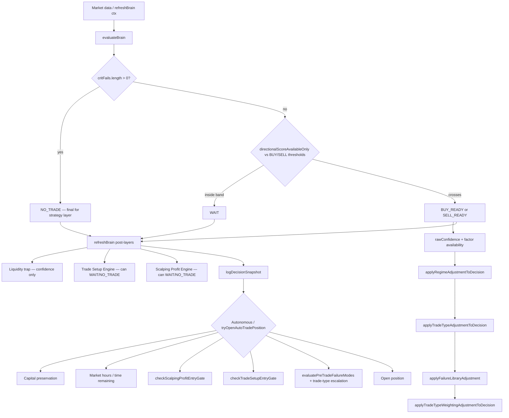

# Trade blocking root-cause audit (end-to-end)

**Scope:** `fno-lab-standalone-app` decision pipeline (v16.37.x lineage), cross-checked against your exported diagnostic (`fno-strategy-diagnostic-2026-09-16_2ade.json`, plugin **16.37.2**, **3,467** refreshes).

**Conclusion (executive):** Trades are not failing because “confidence on screen” permanently blocks execution. The decision log shows **zero** `BUY_READY` / `SELL_READY` rows, so **execution gates (SPE, TSE, Failure-Mode Library, capital preservation) almost never run**. The dominant stop is **`evaluateBrain()` → `criticalFails` → `NO_TRADE`**, especially **`Expiry` + `Value Decay` on the last day(s) to expiry**. That matches **~96.5%** of sampled NO_TRADE rows (`193/200`: “Critical fail: Value Decay, Expiry”). Confidence is a **downstream label** on that path, not the first gate.

---

## 1. Pipeline map (authoritative order)



**Final authority by stage**

| Stage | Who decides | Can open a trade if brain says NO_TRADE? |
|--------|-------------|------------------------------------------|
| Strategy signal | `critFails` then thresholds | No |
| Post refresh (TSE/SPE) | Downgrade only if already BUY/SELL | No |
| Execution | `tryOpenAutoTradePosition` | No |

Your diagnostic funnel (**last window**): **2,539** `NO_TRADE`, **928** `WAIT`, **49** refreshes with `tradeTypeWeightingAdjustment`, **0** `BUY_READY`/`SELL_READY`, **0** setups reaching execution analysis.

---

## 2. What influences “can we trade?”

### 2.1 Hard critical fails (`critFails` → immediate `NO_TRADE`)

Evaluated **before** directional thresholds and **before** confidence adjustments:

| Factor | Code trigger | Scalping-aware? |
|--------|----------------|-----------------|
| **Value Decay** | `shouldPushValueDecayCriticalFail(ctx, decayCritPct)` | **Partially** — waives 5% rule when DTE > 1; on DTE ≤ 1 still blocks if θ/premium > 5%; always blocks ≥ 35% |
| **Expiry** | `ctx.decay.days <= 1` | **No** — unconditional critFail |
| Ban List | symbol in live ban list | No |
| Max Loss | `todayPnL < -2000` | No |
| Personal | `internet` or `mindset` checklist false | No |
| Market-Wide Circuit Breaker | halt factor fail | No |

Relevant code:

```14924:14926:fno-lab/fno-lab-standalone-app/assets/fno-lab-core.js
  const decayCritPct = computeValueDecayCriticalPct(ctx);
  if (shouldPushValueDecayCriticalFail(ctx, decayCritPct)) critFails.push({factor:'Value Decay'});
  if (ctx.decay && ctx.decay.days <= 1) critFails.push({factor:'Expiry'});
```

```586:596:fno-lab/fno-lab-standalone-app/assets/fno-lab-core.js
function shouldPushValueDecayCriticalFail(ctx, decayCritPct) {
  if (decayCritPct === null) return false;
  if (isScalpingProfitProfileActive()) {
    const days = ctx.decay && typeof ctx.decay.days === 'number' ? ctx.decay.days : null;
    if (days !== null && days <= FNO_SCALPING_PROFIT_PROFILE.valueDecayHardBlockMaxDays) {
      return decayCritPct > FNO_SCALPING_PROFIT_PROFILE.valueDecayCriticalPctNearExpiry;
    }
    return decayCritPct >= FNO_SCALPING_PROFIT_PROFILE.valueDecayExtremePct;
  }
  return decayCritPct > 5;
}
```

```15267:15282:fno-lab/fno-lab-standalone-app/assets/fno-lab-core.js
  if(critFails.length>0){ decision='NO_TRADE'; reason=`Critical: ${critFails.map(f=>f.factor).join(', ')}`; }
  else if(decisionDirectionalScore>=BUY_THRESHOLD){
    decision='BUY_READY';
    ...
  }
  else if(decisionDirectionalScore<=SELL_THRESHOLD){
    decision='SELL_READY';
    ...
  }
  else {
    decision='WAIT';
    ...
  }
```

**Important asymmetry:** Scalping profile **relaxed Value Decay for DTE > 1** (v16.30.4+), but **`Expiry` still hard-blocks all of DTE ≤ 1** regardless of profile. On expiry day, ATM weekly options also routinely exceed **5% θ/premium**, so **both** critFails fire together — exactly what your sample reasons show.

### 2.2 Directional thresholds (after critFails)

- Score used: **`directionalScoreAvailableOnly`** (missing directional inputs skipped, not scored as fail).
- Default thresholds: **buy 11 / sell −17**; with **Scalping Profit Profile + trading mode**, `getModeEffectiveThresholds()` can lower to **8 / −13** (conservative mode) when `trading-modes-engine.js` is loaded in the browser bundle.
- **928 WAIT** rows: score between thresholds and/or post-threshold downgrades (regime, failure library, weighted score — see below).

### 2.3 Confidence (UI + soft gates)

Computed **after** the `NO_TRADE` / `BUY_READY` / `WAIT` branch:

```15301:15316:fno-lab/fno-lab-standalone-app/assets/fno-lab-core.js
  const rawConfidence = scoreMagnitude >= rangeSpan * 0.7 ? 'High' : (scoreMagnitude >= rangeSpan * 0.35 ? 'Medium' : 'Low');
  const confFromAvailability = factorDataAvailability
    ? applyFactorAvailabilityToConfidence(rawConfidence, factorDataAvailability)
    : { confidence: rawConfidence, ... };
  let confidence = confFromAvailability.confidence;
```

- **Does not** flip `NO_TRADE` ↔ `WAIT` when `critFails` already fired.
- **Can** downgrade marginal `BUY_READY` → `WAIT` via regime / trade-type history (`applyRegimeAdjustmentToDecision`, etc.).
- **Can block opens** via `checkScalpingCapitalPreservation` when enabled (default **ON**): requires **High** confidence (mode-dependent), blocks weighted-score safety, trap pre-gates, daily loss caps — but only inside **`tryOpenAutoTradePosition`**, not in your log’s signal counts.

### 2.4 Post-`evaluateBrain` layers (refreshBrain only)

Applied only if decision is already `BUY_READY` / `SELL_READY`:

- **TSE** (`applyTradeSetupInfluence`) → `WAIT` / `NO_TRADE` if setup not allowed.
- **SPE** (`applyScalpingProfitInfluence`) when mode is not `SIGNAL_ONLY` → same.
- **Liquidity trap** → confidence adjustment only (not decision) in current code.

Your log’s **0** BUY/SELL means these layers did **not** cause the session-wide silence; they would matter only after critFails/threshold issues are fixed.

### 2.5 Execution gate (`tryOpenAutoTradePosition`)

Order (simplified): capital preservation → market hours → time remaining for trade type → re-entry cooldown → CE/PE vs BUY/SELL alignment → **SPE** → **TSE** → **FM block/reject** → fill simulation.

Pre-trade FM does **not** change logged `decision` (by design); it blocks opens and is reflected in `blockReason` when a setup existed. With **0 setups**, this gate was idle.

---

## 3. Evidence from your diagnostic export

| Metric | Value | Interpretation |
|--------|-------|----------------|
| Refreshes | 3,467 | Large sample |
| Decision log BUY/SELL | **0** | Strategy layer never produced an executable signal |
| NO_TRADE | 2,539 (~73%) | Dominated by critical fails |
| WAIT | 928 (~27%) | Threshold band / soft downgrades |
| Weighted-score notes | 49 | Secondary; not the main mass |
| Sample NO_TRADE reasons (n=200) | **193×** “Critical fail: Value Decay, Expiry” | Single recurring blocker cluster |
| Trades taken | 4 (losses) | Historical; not from current signal funnel |
| PE / SELL_READY | None in log | Consistent with no bearish-ready signals |

**Frequency estimate (from full funnel + sample):**

| Blocker | ~Share of refreshes | Functioning as coded? | Over-restrictive? |
|---------|---------------------|------------------------|-------------------|
| **Expiry (DTE ≤ 1)** | Very high on expiry sessions | Yes | **Debatable for scalping** — intentional hard stop vs product goal (“many short scalps”) |
| **Value Decay (DTE ≤ 1, θ% > 5)** | Overlaps Expiry on last day | Yes | **Redundant** with Expiry on same day; ATM weeklies often >5% |
| **Value Decay (DTE > 1, non-scalping)** | High if profile off | Yes | **Yes for intraday-only** — 5% rule blocks many valid DTE 2–5 days |
| WAIT (score band) | ~27% | Yes | Cumulative decay **scoring** pulls score down near expiry |
| Weighted score safety | ~1.4% | Yes | Conservative by mode policy |
| Confidence / capital preservation | Not in signal log | Yes at **open** time | Can block **opens** once signals exist |
| SPE / TSE / FM | 0 signal rows | N/A this session | Not root cause today |

---

## 4. Scenario traces (code-backed)

Run reproducibly: `node tests/trade-blocking-dte-trace.js` (uses real `evaluateBrain`, default scalping settings).

### Scenario A — Strong bullish, **DTE = 1** (expiry day)

| Step | Result |
|------|--------|
| Trigger | Artificial bullish Operator Intel + trend; spot above EMA/VWAP |
| Supporting | High contrib signals, bullish flow/tech |
| Opposing | θ/premium **~51%**, Expiry critFail, decay factor scores negative |
| Score | Directional ~**2.8** (would be WAIT even without critFails) |
| Confidence | **Low** (low \|score\|) — **effect**, not cause |
| Passed | Many soft factors |
| Failed | **Value Decay**, **Expiry** critFails |
| **Final authority** | `critFails.length > 0` → **`NO_TRADE`** |
| Justified? | Risk policy for expiry/theta — **yes for swing**; **conflicts with aggressive scalping on expiry** if that is the product intent |
| Duplicate? | **Yes** — Expiry + Value Decay both fire on same session |
| To become eligible | Trade **DTE ≥ 2** series, or change policy for scalping on DTE=1 (see §6) |

### Scenario B — Strong bullish, **DTE = 2** (scalping profile on)

| Step | Result |
|------|--------|
| θ/premium | ~**26%** — **no** Value Decay critFail (waived when DTE > 1 unless ≥35%) |
| Expiry critFail | **No** (days > 1) |
| Directional score | ~**9.9** vs buy threshold **11** |
| **Final authority** | Threshold band → **`WAIT`** |
| Opposing | Decay category **scored** negatives (Value Decay Per Day, Theta Rs) |
| Confidence | **Medium** — display only |
| To become eligible | Stronger directional alignment **or** lower buy threshold (mode 6–8) **or** reduce decay penalty stacking near expiry |

### Scenario C — Strong bullish, **DTE = 3**, scalping profile **OFF** (intraday only)

| Step | Result |
|------|--------|
| θ/premium | ~**17.5%** |
| Value Decay critFail | **Yes** (>5% non-scalping rule) |
| **Final authority** | **`NO_TRADE`** — Value Decay only |
| Lesson | Disabling scalping profile restores **strict 5% hard block** for most near-term options |

### Scenario D — Hypothetical **`BUY_READY`** reaching execution (not seen in your log)

If brain reached `BUY_READY`, logged decision could still become `WAIT` via TSE/SPE in `refreshBrain`. Open would then require:

1. Autonomous mode / manual open path  
2. `checkScalpingCapitalPreservation` (**High** confidence default)  
3. `checkScalpingProfitEntryGate` (unless SPE `SIGNAL_ONLY`)  
4. `checkTradeSetupEntryGate`  
5. FM `finalAction` not `block`/`reject`  

**Decisive at final stage today:** none — pipeline never delivered `BUY_READY`.

### Scenario E — Critical fail vs positive score (regression guard)

`tests/end-to-end-decision-engine-audit.test.js` Scenario 5: with Max Loss + Ban List critFails, **directional score ≥ 11** still → **`NO_TRADE`**. Critical layer is never averaged away.

---

## 5. Confidence deep-dive (why it looks “always low” on NO_TRADE days)

1. **Order of operations:** `NO_TRADE` is chosen when `critFails` exist **before** confidence is calculated.  
2. **Formula:** confidence scales with **\|directionalScoreAvailableOnly\|** vs threshold span — on expiry, decay-heavy scores are **small**, so UI shows **Low/Medium**.  
3. **Missing data:** `applyFactorAvailabilityToConfidence` may downgrade one tier when directional coverage is thin — does not create `NO_TRADE` alone.  
4. **Capital preservation:** uses displayed confidence to **block opens**, not to set `NO_TRADE` in the log.  
5. **Not a permanent bug:** with DTE=15 bullish fixture, audit test produces **`BUY_READY`** + **High** confidence.

---

## 6. Cumulative conservatism (many reasonable filters)

Even when no single rule is “wrong”:

| Layer | Effect near weekly expiry |
|-------|---------------------------|
| Expiry critFail (DTE ≤ 1) | **Hard zero signals** all day |
| Value Decay critFail (DTE ≤ 1) | Same days — **double block** |
| Decay **scoring** (DTE 2–4) | Pulls directional score **below** buy threshold → **WAIT** |
| Scalping thresholds + weighted policy | Extra **WAIT** when raw score crosses but weighted does not (~49 logs) |
| TSE + SPE (when signals exist) | Second and third quality bars |
| Capital preservation + FM at open | Fourth and fifth bars |

Your session data matches **first two rows dominating**, not “confidence stuck below threshold.”

---

## 7. Contradictions / redundancy / bugs

| Issue | Type | Severity |
|-------|------|----------|
| **Expiry** unconditional DTE≤1 vs scalping Value Decay waiver for DTE>1 | Policy inconsistency | **High** for expiry-day scalping |
| Value Decay critFail + Expiry on same refresh | Redundant | Medium |
| Non-scalping 5% Value Decay block at DTE 3–5 | Very conservative | High if profile disabled |
| `pretradeGateCheck` vs open-time FM | Informational mismatch possible | Low (UI transparency) |
| FM001–003 historically dead without `brain.regime` | **Fixed** in evaluateBrain return | Low (past) |
| Live trade blow-up in diagnostic (CE entry ~11540 vs exit ~1127) | **Data/symbol/strike mismatch** at execution | Separate from signal silence |

No evidence that **confidence calculation is mathematically broken**; it aligns with low directional magnitude on blocked days.

---

## 8. Recommended code-level corrections (safest first — do not merge without explicit risk acceptance)

1. **Align Expiry gate with scalping policy (minimal, targeted)**  
   - Option A: Push `Expiry` critFail only when `days < 1` (calendar expiry day after cutoff) or hours-to-expiry < X, not all of `days <= 1`.  
   - Option B: For `isScalpingProfitProfileActive()`, skip **Expiry** critFail and rely on Value Decay + decay scoring + FM022 + square-off timers (document in UI).  
   - **Risk:** More expiry-day exposure; mitigate with existing time-to-square-off and SPE quality.

2. **De-duplicate last-day blocks**  
   - If Expiry remains, consider **only** Expiry critFail on DTE≤1 and treat Value Decay as **scored + FM** only (not second critFail) when Expiry already fired — reduces reason noise, same net on worst days.

3. **Operational checks (no code)**  
   - Confirm selected expiry in UI → `ctx.decay.days` on diagnostic rows (`entryDaysToExpiry` in decision log). If always **0–1**, signals will stay **NO_TRADE** by design.  
   - Confirm **Scalping Profit Profile** + **scalping** type enabled; intraday-only restores 5% hard block at DTE 3+.  
   - For more entries without weakening expiry rules: roll to **next weekly** (DTE ≥ 2) where trace shows `BUY_READY` possible.

4. **Measurement**  
   - Extend diagnostic export to aggregate **`critFailIds`** over full log (not only 200-row sample) — funnel already supports `topCritFailReasonsList` in UI via `computeEligibilityFunnel`.

5. **Execution path (after signals exist)**  
   - Temporarily set SPE to **SIGNAL_ONLY** to separate “no signal” vs “signal blocked at open.”  
   - Review **capital preservation** min confidence vs your typical **Medium** marginal setups.

---

## 9. Answer to your ten audit points (checklist)

1. **Rules/factors** — §2.1–2.5  
2. **Decision flow** — §1 diagram  
3. **Recurring blockers** — Expiry + Value Decay (~96% of sample NO_TRADE reasons)  
4. **Confidence** — §5; not primary gate for your log  
5. **Multiple rejections** — critFails are OR’d into one `NO_TRADE`; not accumulated penalties on same gate  
6. **Contradictions / impossible conditions** — §7; DTE≤1 Expiry is always true on last session day  
7. **Conservative config** — §6 cumulative table  
8. **Scenario traces** — §4  
9. **Decisive final factor** — **`critFails` before thresholds** this session  
10. **Execution gate** — idle (0 setups); when active, SPE/TSE/FM/capital preservation chain in §2.5  

---

## 10. Files referenced

| File | Role |
|------|------|
| `assets/fno-lab-core.js` | `evaluateBrain`, critFails, confidence, `refreshBrain`, `tryOpenAutoTradePosition` |
| `assets/scalping-profit-engine.js` | SPE entry gate |
| `assets/trade-setup-engine.js` | TSE influence |
| `assets/trading-modes-engine.js` | Mode thresholds / capital preservation params |
| `assets/strategy-diagnostic-report.js` | Funnel / eligibility metrics |
| `tests/end-to-end-decision-engine-audit.test.js` | Regression scenarios |
| `tests/trade-blocking-dte-trace.js` | DTE / Value Decay / Expiry traces |

---

*Audit performed by static trace + executable fixtures; no trading thresholds were changed in code as part of this document.*
